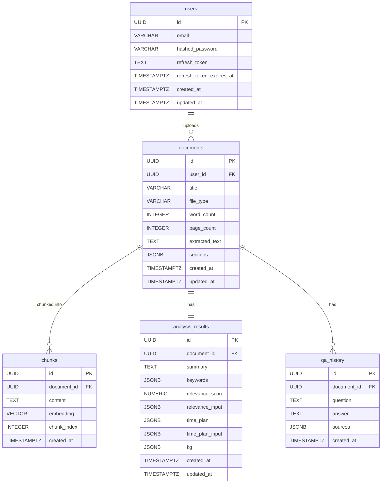

# FDocs — Database Schema

> PostgreSQL + pgvector | Cập nhật: 2026-06-15

---

## ERD

---

## Chi tiết bảng

### users
| Column | Type | Constraints |
|---|---|---|
| id | UUID | PK, DEFAULT gen_random_uuid() |
| email | VARCHAR(255) | NOT NULL, UNIQUE |
| hashed_password | VARCHAR(255) | NOT NULL |
| refresh_token | TEXT | NULLABLE |
| refresh_token_expires_at | TIMESTAMPTZ | NULLABLE |
| created_at | TIMESTAMPTZ | NOT NULL, DEFAULT NOW() |
| updated_at | TIMESTAMPTZ | NOT NULL, DEFAULT NOW() |

### documents
| Column | Type | Constraints |
|---|---|---|
| id | UUID | PK, DEFAULT gen_random_uuid() |
| user_id | UUID | NOT NULL, FK → users(id) ON DELETE CASCADE |
| title | VARCHAR(500) | NOT NULL |
| file_type | VARCHAR(10) | NOT NULL, CHECK IN ('pdf', 'docx') |
| word_count | INTEGER | NULLABLE |
| page_count | INTEGER | NULLABLE (chỉ có với PDF) |
| extracted_text | TEXT | NOT NULL |
| sections | JSONB | NULLABLE — heading structure detect bởi AI/regex, dùng cho Time Plan |
| created_at | TIMESTAMPTZ | NOT NULL, DEFAULT NOW() |
| updated_at | TIMESTAMPTZ | NOT NULL, DEFAULT NOW() |

### chunks
| Column | Type | Constraints |
|---|---|---|
| id | UUID | PK, DEFAULT gen_random_uuid() |
| document_id | UUID | NOT NULL, FK → documents(id) ON DELETE CASCADE |
| content | TEXT | NOT NULL |
| embedding | vector(768) | NOT NULL — Gemini text-embedding-004 |
| chunk_index | INTEGER | NOT NULL |
| created_at | TIMESTAMPTZ | NOT NULL, DEFAULT NOW() |

**Index**: HNSW trên `embedding` dùng cosine similarity.

### analysis_results
| Column | Type | Constraints |
|---|---|---|
| id | UUID | PK, DEFAULT gen_random_uuid() |
| document_id | UUID | NOT NULL, UNIQUE, FK → documents(id) ON DELETE CASCADE |
| summary | TEXT | NULLABLE |
| keywords | JSONB | NULLABLE — `["keyword1", "keyword2"]` |
| relevance_score | NUMERIC(4,3) | NULLABLE — 0.000–1.000 |
| relevance_input | JSONB | NULLABLE — `{"goal": "", "keywords": [], "topic": ""}` |
| time_plan | JSONB | NULLABLE — `[{"date": "", "sessions": [{"title": "", "pages": 0}]}]` |
| time_plan_input | JSONB | NULLABLE — `{"start_date": "", "deadline": "", "hours_per_day": 0}` |
| kg | JSONB | NULLABLE — `{"nodes": [...], "edges": [...]}` |
| created_at | TIMESTAMPTZ | NOT NULL, DEFAULT NOW() |
| updated_at | TIMESTAMPTZ | NOT NULL, DEFAULT NOW() |

### qa_history
| Column | Type | Constraints |
|---|---|---|
| id | UUID | PK, DEFAULT gen_random_uuid() |
| document_id | UUID | NOT NULL, FK → documents(id) ON DELETE CASCADE |
| question | TEXT | NOT NULL |
| answer | TEXT | NOT NULL |
| sources | JSONB | NULLABLE — `[{"chunk_id": "", "chunk_index": 0, "excerpt": ""}]` |
| created_at | TIMESTAMPTZ | NOT NULL, DEFAULT NOW() |

---

## Indexes

| Bảng | Column | Loại | Mục đích |
|---|---|---|---|
| users | email | UNIQUE B-tree | Login lookup |
| documents | user_id | B-tree | "Tất cả doc của user" |
| chunks | document_id | B-tree | "Tất cả chunks của doc" |
| chunks | embedding | HNSW (cosine) | Vector similarity search |
| analysis_results | document_id | UNIQUE B-tree | "Kết quả phân tích của doc" |
| qa_history | document_id | B-tree | "Lịch sử Q&A của doc" |
